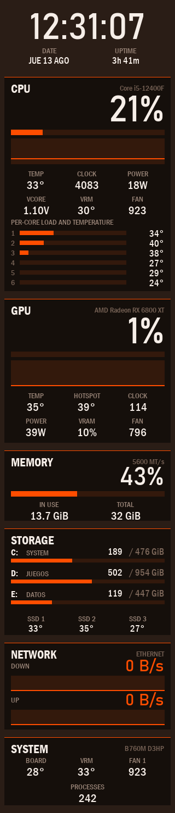
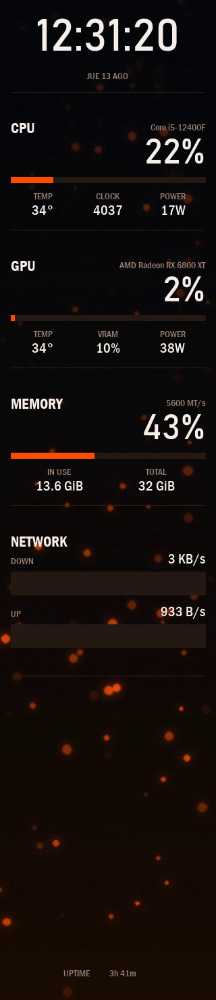
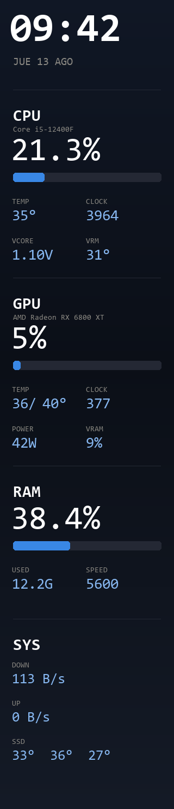

# Solarmax CM-B600L — open driver for the case LCD panel

A free replacement for **LCD Control**, the vendor software for the 320x1480 LCD panel in the
**Solarmax CM-B600L** case, which Windows enumerates as `HL-VMAX-USB-Device`
(VID_33C3 / PID_F101). It works with any case carrying the same panel: the COM port and the
panel geometry are autodetected, nothing about the hardware is hardcoded.

Written on 2026-08-11 because the vendor app showed **CPU 100%** at a real load of 65%.

<p align="center">
  
  
  
</p>
<p align="center">
  <em>Apex, Embers and Vitals — the three profiles shipped with the repo, exactly as
  <code>--save</code> renders them. Not one value is hand-written: everything is read from the
  machine.</em>
</p>

The layout is **data, not code**: one JSON per profile, hot-reloaded on save, with a graphical
editor and a tray app. Sensors come from WMI, PDH and LibreHardwareMonitor, with no ring0
driver of any kind.

**Licensed under [PolyForm Noncommercial 1.0.0](LICENSE)**: use it, modify it and share it for
any noncommercial purpose. Selling it is not allowed. To contribute, see
[CONTRIBUTING.md](CONTRIBUTING.md).

> **On language:** the project is in English throughout — docs, command line, tray menu,
> editor, messages, code comments and tests. Every command-line flag keeps its old Spanish
> name as an alias (`--status` and `--estado` are the same flag), so nothing already installed
> or scripted breaks. A few internal identifiers are still Spanish; renaming those is a
> refactor, not a translation. `apex-es.json` is the author's own Spanish version of Apex,
> kept as an example of how far a profile can be localised: labels are data, so translating
> one is editing text in a JSON file.

## From scratch

On a new machine, in this order:

```powershell
git clone https://github.com/knupson/solarmax-cm-b600l-panel
cd solarmax-cm-b600l-panel
pip install -r requirements.txt
python -m vmaxpanel --diagnose          # says what is missing and what is optional
python -m vmaxpanel --save preview.png  # a PNG, without touching the panel: proves it renders
python -m vmaxpanel --profile vmaxpanel\profiles\apex.json --install   # administrator console
```

**Verified from a clean clone**: the full test suite passes and the panel draws completely
*without* the sensor DLLs — clock, CPU load, temperature and VCORE (those come from GSA1, not
from the DLLs), RAM, disks with real sizes, uptime and process count. What you lose without
them is the GPU, per-core figures, disk temperatures and fan RPM. The diagnostic marks them
**optional** and tells you where to download them. It is the one step that cannot be
automated: they are third-party binaries and this repo does not redistribute them.

`--install` needs an **administrator console**, because the scheduled task runs elevated
(without elevation there is no GSA1 and no SMART).

## Why it exists

`CpuUsage` and `CpuUse`, the only CPU tokens LCD Control exposes, are PDH's
**`% Processor Utility`**: load × (current clock / base clock). On an i5-12400F (2500 MHz
base, ~4080 all-core) that factor is **~1.63**, so the value goes past 100 and the panel
**clamps it at 100 for any real load above roughly 61%**.

Confirmed from both sides within the same second:

| Source | Value |
|---|---|
| The app's own internal stdout | `Processor 110,7` |
| My PDH counter `% Processor Utility` | `110,5` |
| Real load (`% Processor Time`) | `69,2` |

All 34 sensors in that app are PDH counters; even its per-thread readings exceed 100
(`CPU #9 = 107,2`). There is no token carrying time-based load: about 38 names were tried.

## The panel protocol

Reverse-engineered with frida, hooking `WriteFile` inside the vendor app's process.

```
open \\.\COM<n>                     (CDC; the baud rate is irrelevant)
TX  F0 A5 5A 0F                     handshake
RX  "VMAXA170320*1480S<serial>"     serial number, 26 ASCII bytes
TX  AA BB <brightness 0..100> CC DD
TX  <JPEG>                          one WriteFile per frame
```

The frame is a **raw 320x1480 baseline 4:2:0 JPEG**, with no header and no framing: it starts
at `FFD8FF` and ends at `FFD9`. The panel is mounted upside down inside the case, so frames go
out **rotated 180°** (`--rotate`).

The panel width and height are parsed out of that serial number, which is why nothing is
hardcoded. The COM port is found by VID/PID.

## Sensors

LibreHardwareMonitor's ring0 driver (**WinRing0**) is **blocked** on Windows:
`StartService → 0xE1` (`ERROR_VIRUS_INFECTED` — it is on the vulnerable-driver blocklist). No
MSR access. Everything below is **driverless and read-only**.

| Reading | Source |
|---|---|
| CPU load (real) | PDH `% Processor Time` via psutil |
| CPU clock | PDH `% Processor Performance` × the CPU's real base clock |
| CPU temperature | Gigabyte GSA1 ACPI-WMI, `ZFCGetCurrentTemp(id=2)` |
| VRM temperature | same interface, `id=4` |
| VCore | same interface, `EZVGetVoltage(Id=5)` (mV) |
| CPU package power | LibreHardwareMonitor, Intel RAPL |
| Per-core load, clock and temperature | LibreHardwareMonitor |
| Fan RPM | LibreHardwareMonitor, motherboard SuperIO (ITE IT8689E) |
| GPU load, temperature, hot spot, power, clock, fan | LibreHardwareMonitor |
| VRAM used | `D3D Dedicated Memory Used`, over the adapter's real total (see below) |
| SSD temperatures | LibreHardwareMonitor, NVMe SMART |
| RAM usage, network | psutil |
| RAM speed | `Win32_PhysicalMemory.ConfiguredClockSpeed` (MT/s), falling back to `Speed` |

**GSA1** is `root\WMI`, class `GSA1_ACPIMethod`, instance `ACPI\PNP0C14\GSADEV0_0`. The ids
were identified by correlating with load: id2 rose +10 °C and id4 +9 °C under 100% CPU, while
0/1/3/5 did not move. `ECLReadByte/Word` is **not implemented** on the B760M D3HP ("invalid
object"). `PIORead8` does work.

> **Careful:** GSA1 also exposes `PIOWrite*`, `MEMWrite*` and `PCIWrite*` — arbitrary writes to
> I/O ports, physical memory and PCI space. This driver uses **read methods only**. Do not add
> writes without knowing exactly which register they land on.

Two readings need more than a sensor name:

- **VRAM used.** LibreHardwareMonitor's `Load / GPU Memory` is *not* the fraction of VRAM in
  use — on AMD it is memory-bus utilization, which read 1% while 1.5 GB of 16 GB were
  allocated. The used figure comes from `SmallData`, preferring `GPU Memory Used`/`Total` when
  the card serves them (NVIDIA, Intel) and falling back to `D3D Dedicated Memory Used` (AMD).
  The total does **not** come from `Win32_VideoController.AdapterRAM`: that field is a uint32
  and overflows above 4 GB. It comes from the driver's own 64-bit
  `HardwareInformation.qwMemorySize`. With no total available the metric is simply not
  published, which the panel reports honestly instead of showing a number computed against a
  guess.
- **Package power and CPU fan RPM** were long documented here as impossible, because they were
  believed to need MSR and SuperIO index writes. They are not: LibreHardwareMonitor 0.9.3 reads
  RAPL without loading any ring0 driver, and the fans come off the ITE SuperIO. Both are on the
  panel today.

## Layout of the repo

```
vmaxpanel/    the data-driven engine: app.py (supervisor), tray.py, editor.py,
              engine.py, cli.py, layout/, render/, providers/, transport/, profiles/
daemon/       the previous version, kept byte-identical as the rollback path
docs/         design specs, implementation plans and the README screenshots
tests/        594 tests, no hardware required
```

## Running it

```powershell
python -m vmaxpanel.tray --log vmaxpanel.log   # tray icon and menu; supervises the engine
python -m vmaxpanel                            # engine only, with the default profile
python -m vmaxpanel --once                     # a single frame
python -m vmaxpanel --save preview.png         # render to PNG, does not touch the panel
python -m vmaxpanel --save p.png --no-sensors  # same, without launching the sensor sidecar
python -m vmaxpanel.editor                     # layout editor
python -m vmaxpanel --status                   # is it drawing right now?
python -m vmaxpanel --stop                    # bring the whole thing down
```

Editing `vmaxpanel/profiles/<profile>.json` **reloads live**, with no restart. A broken JSON
does not blank the panel: the previous layout stays up and the error shows in the status.

### The tray app

The tray menu carries the status (connection, frames drawn, last error, metrics with no data),
pause and resume, restart the engine, open the editor, open the JSON and view the log.
**Pausing releases the COM port**, which is how you hand the panel over to LCD Control without
closing anything.

The editor saves atomically and the engine picks the change up live. There is no IPC between
the two processes: **the file is the protocol**. The editor never saves an invalid layout,
because the engine would reject it and the user would have "saved" something the panel ignores.

The design notes are in `docs/superpowers/specs/2026-08-12-vmax-panel-fase3-design.md`,
including **why there is no Windows service**: a service runs in session 0, and from there it
cannot show a tray icon or a window at all.

### Install and autostart

```powershell
python -m vmaxpanel --diagnose                  # checks and exits, changes nothing
python -m vmaxpanel --profile <profile> --install # checks, then registers the logon task
python -m vmaxpanel --uninstall                  # removes the task
```

`--diagnose` is what to run when "it does not work": dependencies (named as pip names, not
import names — "PIL is missing" sends people looking for a package that does not exist), the
sensor DLL, the profile and the panel. Three states rather than two: **ok**, **MISSING**
(blocks operation, and blocks `--install`) and **optional** — without ffmpeg you lose video
backgrounds and nothing else, and an unplugged panel is not a problem because the tray keeps
retrying. An "Access denied" on the port is translated to *in use*: pyserial wraps the
`PermissionError` in a `SerialException`, and read literally it sends you to fight UAC instead
of to close LCD Control.

`--install` registers the task **from XML**, not via `/SC ONLOGON`, because the schtasks
defaults refuse to start on battery, kill the task when you unplug, and stop it after 72 hours:
on a laptop that is the panel switching itself off. It uses **`RunLevel HighestAvailable`** —
GSA1 and NVMe SMART both need elevation — which is why registering it needs an administrator
console. It registers with `/F`, so reinstalling replaces and running it twice leaves a single
task. The XML is written as UTF-16 because schtasks rejects UTF-8 with "The task XML is
malformed" without ever mentioning that the encoding is the problem.

`pythonw.exe` has no console, so **`--log` is not optional here**: without it, an engine that
dies at logon leaves a black screen and no trace. The log is flushed per line and includes the
traceback of anything that escapes. It earned its keep on the tray's first run, catching an
`OverflowError` inside a Win32 callback (`DefWindowProcW` without `argtypes`, with a 64-bit
`LPARAM`) that Python swallows as "Exception ignored" and that left the window silently unable
to process messages.

To test the task without rebooting: `Stop-ScheduledTask PanelVitals` then
`Start-ScheduledTask PanelVitals`, and read the log. Watch out for two instances fighting over
the COM port — kill the manual one first.

If LCD Control is started by hand it will fight for the port. The engine retries every 5 s, but
it is better not to run both.

### Bringing it down for real

```powershell
python -m vmaxpanel --stop
```

Three things, because all three are needed: it stops the scheduled task (otherwise it returns
at the next logon), kills the tray and the engine, and kills the **sensor sidecar** — a
`powershell.exe` running `sensors.ps1` that outlives everything keeps
`LibreHardwareMonitorLib.dll` locked and blocks moving or deleting the directory. That is this
project's recurring trap.

It recognises its own processes **by command line, not by image name**: they are all
`python.exe`, `pythonw.exe` and `powershell.exe`, and killing by name would take out any of the
user's own scripts. If a process cannot be inspected or killed — the tray runs elevated — it
says so and asks for an administrator console, instead of reporting that there was nothing to
do.

`daemon/stop.ps1` does not know about the new engine **and cannot be fixed**: `daemon/` is the
byte-identical rollback path for the whole rewrite.

### Knowing whether it is running

```powershell
python -m vmaxpanel --status
```

```
drawing - profile Apex, panel ok, 12043 frames, 1 fps
published 2 s ago (pid 23060)
```

Exit code **0** when it is drawing and **1** when it is not — not 2, because "not running" is an
answer rather than a usage error, and a script has to be able to tell those apart.

The process driving the panel publishes its status to `vmaxpanel-estado.json` every 5 s, with
an atomic replace. A file rather than a socket: the reader does not need to talk to the
process, only to know what it sees, so there is no port to open and no stuck reader that could
affect the engine. **The age is always reported**, because a process can be alive and not
publishing — an engine wedged in a write to the port still exists — and anything more than 30 s
stale is called out. It also distinguishes *paused* from *stopped*: pausing releases the port on
purpose, and confusing the two sends people to restart something that is fine.

It exists because there was no other way. The tray has the status in its menu, but from a
console the only observable things were the log and the process's CPU usage. Verifying the
panel works by watching a `pythonw` process's CPU is guessing, and it went wrong three times in
one day.

### Sharing and backing up a profile

```powershell
python -m vmaxpanel --profile <profile> --export my-profile.vmaxpanel
python -m vmaxpanel --import my-profile.vmaxpanel
python -m vmaxpanel --import other.vmaxpanel --if-exists rename
```

Also from the editor (**Exportar… / Importar…**, with a file dialog) and from the tray
(**Exportar el perfil…**, which writes into `perfiles-exportados/` with the date in the
filename and opens the folder — the tray is pure ctypes and has no window to put a message in).
Those menu labels are still in Spanish, as noted above.

A `.vmaxpanel` file is a zip holding `perfil.json`, whatever assets the background references,
and a `bundle.json` manifest. **Copying the bare `.json` is not enough:** a profile references
assets and names fonts, so on the other side it shows up with a degraded background and
different fonts, and nobody understands why.

Four decisions that are not obvious:

- **Fonts are not packaged.** Consolas and the Franklin Gothic family belong to Microsoft. They
  are listed in the manifest, and on import you are told which ones are missing *on this
  machine* — the difference between "it looks wrong" and "you are missing this font". That
  question can only be answered on the receiving side, so it is answered on import, not on
  export.
- **The JSON travels byte for byte**, read and written as bytes. With `read_text` Python
  translates CRLF to LF, and the profile that came back was 60 bytes smaller than the original:
  "it is the same file" would have been a lie. A check against the repo's real profiles caught
  it, not the test — the test used a single-line fixture.
- **Import never overwrites by default.** Two people exporting "apex" is normal, and the user's
  layout is their own work. Use `--if-exists rename` or `overwrite` when that is what you want.
- **A zip from elsewhere is treated as hostile.** The profile is validated *before* anything is
  written (a broken bundle must not leave assets half-copied), any member that is absolute,
  contains `..` or carries a drive letter is rejected — zip-slip, and this process runs
  elevated — and extraction is bounded by declared size so a zip bomb cannot run away.

### Backgrounds

`background.type` accepts six: `solid`, `gradient` and `image` (static, cached once), and
`procedural`, `sequence` and `video` (animated, one frame per draw).

| Type | Own keys | Note |
|---|---|---|
| `solid` | `color` | |
| `gradient` | `stops`, `angle` | `angle % 180` in [45,135) is vertical, the rest horizontal. No diagonals |
| `image` | `src`, `fit`, `color` | `color` fills the letterbox |
| `procedural` | `name` (`scroll`\|`pulse`), `speed`, `period`, `stops` | built from the gradient; `scroll` uses the gradient **and its mirror** so the cycle closes without a jump |
| `sequence` | `src` (folder), `fit`, `fps`, `color` | decoded per frame on purpose: caching them is 1.4 MB each |
| `video` | `src` (file), `fit`, `fps`, `color` | mp4, webm, mkv, gif — whatever ffmpeg opens |

In the editor the `src` field has a **Choose…** button that opens a file dialog and **copies
the chosen file into `vmaxpanel/assets/`**. That is not a convenience: `safe_asset_path`
rejects any path escaping that directory — rightly so, the engine runs elevated — so a video on
the Desktop can only work by being copied in. If the name already exists with different
content it is saved as `-2` rather than overwriting another profile's asset; if it exists with
identical content, it is reused.

**Video needs ffmpeg**, which is external: it is looked up in `vmaxpanel/lib/` and then on
PATH (`winget install Gyan.FFmpeg`, or drop `ffmpeg.exe` into `vmaxpanel/lib/`). If it is
missing, the background degrades to a flat colour and the warning carries the install command —
it is not an exception. External rather than PyAV or imageio-ffmpeg because those ship a binary
wheel per platform and Python version, and this project's rule is to add no dependencies.

One ffmpeg per background, emitting raw rgb24 at the panel's exact size; a thread drains it and
publishes only complete frames (`W*H*3` bytes), because half a frame is garbage on screen.
ffmpeg does the looping (`-stream_loop -1`) and the pacing (`-re`): without `-re` it decodes
flat out and burns a core producing frames nobody will see.

The first call for a frame waits up to two seconds for the decoder, and later calls never wait.
That asymmetry matters: a single-shot render needs the real first frame, and the panel loop
cannot pay a wait per frame if the video never opens at all.

**Lifecycle is where the real risk was:** `Renderer.set_layout()` closes the previous
background and `Engine._drop_link()` closes the renderer. Without that, every profile save (a
live reload) and every reconnection left an ffmpeg decoding for nobody — the same orphan-process
pattern this project already had with `sensors.ps1` and the LHM DLL.

Animated backgrounds look frozen in the editor: the preview is **one** frame. The hint on the
Background tab says so, along with whether ffmpeg is present.

## Editing a layout

| What you want to change | Where |
|---|---|
| Position, format or colour of a value | the profile JSON — hot-reloaded on save |
| Text labels | `label` widgets in the same JSON |
| Separators, frames, colour blocks | `rect` widgets in the same JSON |
| Background | the profile's `background` block |
| Which metrics exist | `vmaxpanel/metrics.py` |
| Where each metric comes from | `vmaxpanel/providers/` |
| New sidecar sensors | `vmaxpanel/sensors.ps1` |

### The `rect` widget

It covers dividers, frames and colour blocks. `fill` and `stroke` are independently optional,
but at least one must be present — a rect with neither draws nothing, so the validator rejects
it rather than letting it sit there invisible.

```json
{ "id": "cpu-rule", "type": "rect", "x": 24, "y": 164, "w": 272, "h": 1, "fill": "#242834" }
{ "id": "frame", "type": "rect", "x": 14, "y": 540, "w": 292, "h": 320,
  "radius": 8, "stroke": "#242834", "stroke_width": 2 }
```

Two things that are not obvious:

- **`w`/`h` are the real size in pixels**: `"h": 1` is a one-pixel line. `bar` and `graph` use
  Pillow's inclusive box and end up one pixel larger than written (`"h": 16` → 17 px). They were
  left alone so the profiles and goldens would not move, but a separator cannot afford that.
  `radius` is clamped to half the shorter side.
- **The order of the `widgets` list is the paint order.** There is no `z` field: a `rect` with
  `fill` placed after a text covers it. The profiles' separators come before their section
  header.

## Dependencies

Python 3.13 plus `psutil`, `pyserial` and `pillow`. `ffmpeg` is optional, and only for video
backgrounds. The three DLLs (`LibreHardwareMonitorLib`, `HidSharp`, `HidLibrary`) go in
`vmaxpanel/lib/` — LHM needs HidSharp beside it or `Open()` fails. **They are not in the
repo**: they are third-party and are not redistributed here. `python -m vmaxpanel
--diagnose` says where to get them and what you lose without them. `frida-tools` was only
used to reverse the protocol; the driver does not need it.

## Licence

[PolyForm Noncommercial 1.0.0](LICENSE) — any noncommercial use is allowed, including
modifying and sharing it. Commercial use is not.

What that licence does **not** cover, because it is not mine:

| | |
|---|---|
| `LibreHardwareMonitorLib.dll`, `HidSharp.dll`, `HidLibrary.dll` | MPL-2.0 and MIT, third-party. Not in the repo |
| Consolas, Bahnschrift, Franklin Gothic | Microsoft fonts. Requested by family, never packaged |
| `daemon/assets/back.png` | Artwork from LCD Control's Vitals theme. Not in the repo |
| ffmpeg | External and optional, under its own licence |
