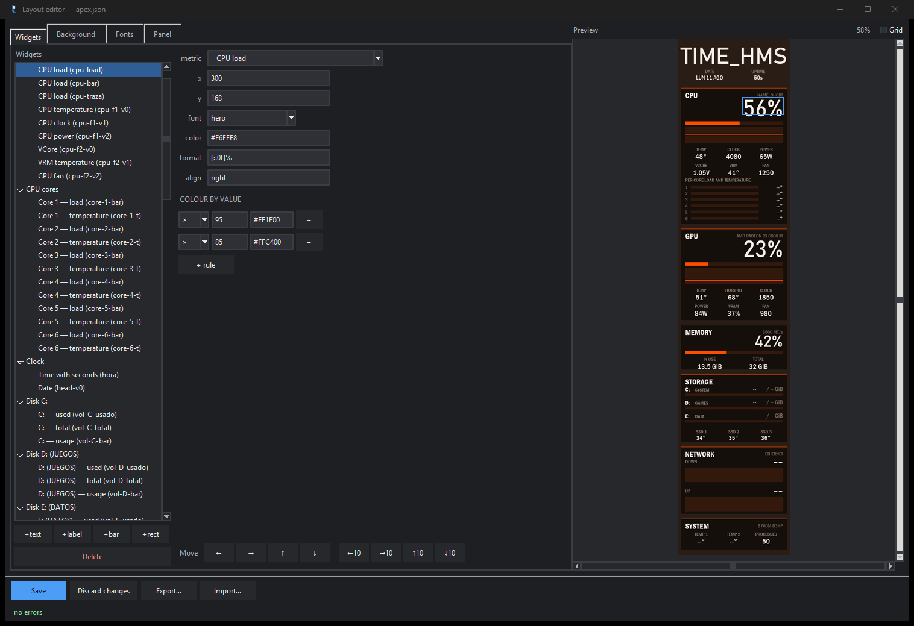

# Solarmax CM-B600L — open driver for the case LCD panel

A free replacement for **LCD Control**, the vendor software for the 320x1480 LCD panel in the
**Solarmax CM-B600L** case, which Windows enumerates as `HL-VMAX-USB-Device`
(VID_33C3 / PID_F101).

It installs as a **tray app**: an icon in the Windows notification area, a right-click menu,
and a window for editing the layout. The panel starts drawing at logon and needs nothing else.

<p align="center">
  
  
  
</p>
<p align="center">
  <em>Apex, Embers and Vitals — three of the profiles that ship with the repo. Every value on
  them is read from the machine.</em>
</p>

The layout is **data, not code**: one JSON file per profile, reloaded live when it is saved,
edited in a graphical editor with a working preview.

<p align="center">
  
</p>

## What it gives you

- A **tray app** with the panel's status, pause and resume, brightness, frame rate, and a
  profile switcher.
- A **layout editor** with a live preview: drag widgets into place, edit fonts, backgrounds and
  colour rules, save and see it on the panel.
- **Four profiles** out of the box — Apex, Apex (castellano), Embers and Vitals.
- **Backgrounds**: solid, gradient, image, procedural, image sequence and video.
- **Sensors without any ring0 driver**: CPU, GPU, RAM, disks, network, fans, temperatures and
  voltages, from WMI, PDH, Gigabyte's GSA1 ACPI-WMI interface and LibreHardwareMonitor.
- **Export and import**: a profile and its assets travel as a single `.vmaxpanel` file.
- **Autostart**: a scheduled task brings the tray up at every logon.
- Panel geometry and COM port **autodetected** — nothing about the hardware is hardcoded, so it
  works with any case carrying the same panel.

## Hardware and requirements

| | |
|---|---|
| Panel | HL-VMAX USB display, VID_33C3 / PID_F101, CDC serial |
| Confirmed device | Solarmax CM-B600L, 320x1480 |
| Sensors | Gigabyte board with the GSA1 ACPI-WMI interface for CPU/VRM temperature and VCore; everything else is vendor-neutral |
| OS | Windows 10 or 11 |
| Python | 3.11 or newer, plus `Pillow`, `pyserial` and `psutil` |
| Optional | `LibreHardwareMonitorLib.dll` + `HidSharp.dll` for GPU, per-core and disk sensors; `ffmpeg` for video backgrounds |

## Documentation

| Page | What is in it |
|---|---|
| [Installing](docs/install.md) | Getting it onto a machine and starting at logon |
| [Using it](docs/using-it.md) | The tray menu, the editor, sharing profiles |
| [Profiles](docs/profiles.md) | The layout format: widgets, backgrounds, fonts, metrics |
| [Hardware](docs/hardware.md) | The panel protocol and where each reading comes from |
| [Command line](docs/command-line.md) | Every `python -m vmaxpanel` flag, for development and troubleshooting |
| [Contributing](CONTRIBUTING.md) | How the project is put together and what a change is expected to look like |
| [Security](SECURITY.md) | Reporting a vulnerability, and the hardware rules that apply to patches |

## What is in the repo

```
vmaxpanel/    the engine and the apps: app.py, tray.py, editor.py, engine.py, cli.py,
              layout/, render/, providers/, transport/, profiles/, assets/
daemon/       the previous version, kept as the rollback path
docs/         these pages and the screenshots
research/     development tools and the generators for the committed assets
tests/        639 tests, no hardware required
```

The project is in English throughout: command line, tray menu, editor, messages and
documentation. Every command-line flag also accepts its original Spanish name as an alias
(`--status` and `--estado` are the same flag). `apex-es.json` is a Spanish version of the Apex
profile, kept as an example of a localised layout.

## Licence

[PolyForm Noncommercial 1.0.0](LICENSE) — any noncommercial use is allowed, including modifying
and sharing it. Commercial use is not.

What that licence does **not** cover:

| | |
|---|---|
| `LibreHardwareMonitorLib.dll`, `HidSharp.dll`, `HidLibrary.dll` | MPL-2.0 and MIT, third-party. Not in the repo |
| Consolas, Bahnschrift, Franklin Gothic | Microsoft fonts. Requested by family, never packaged |
| `daemon/assets/back.png` | Artwork from LCD Control's Vitals theme. Not in the repo |
| ffmpeg | External and optional, under its own licence |
